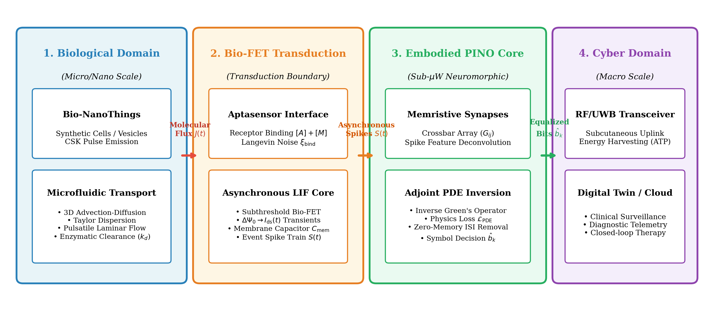
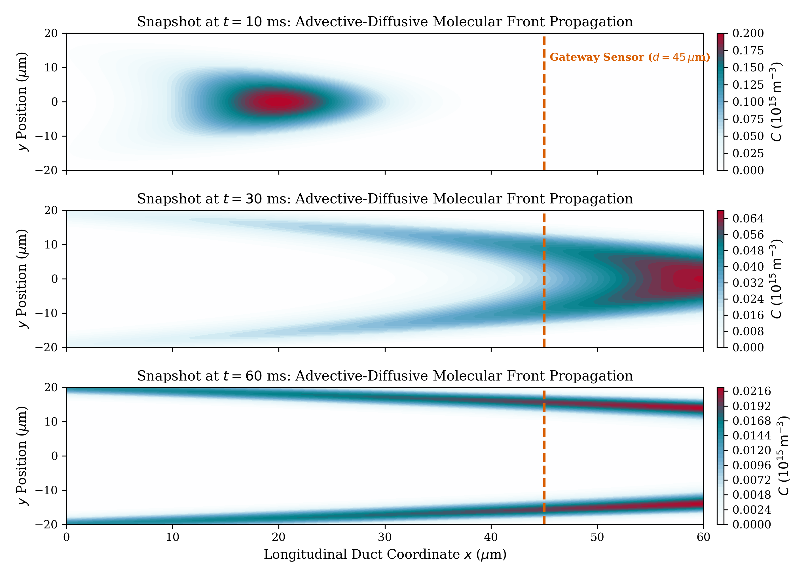
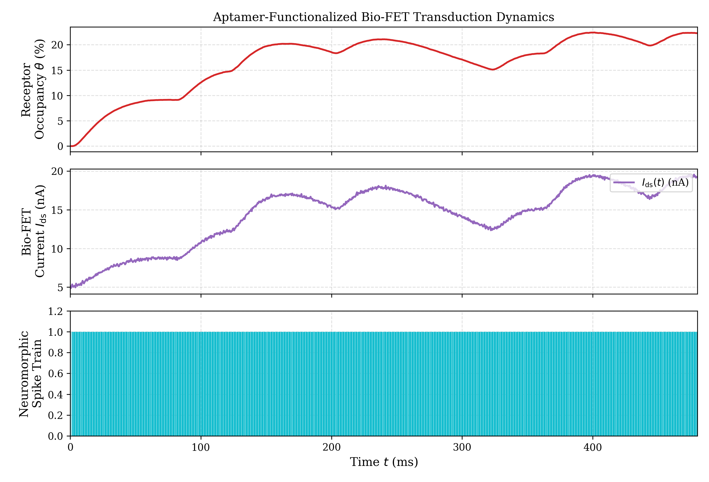
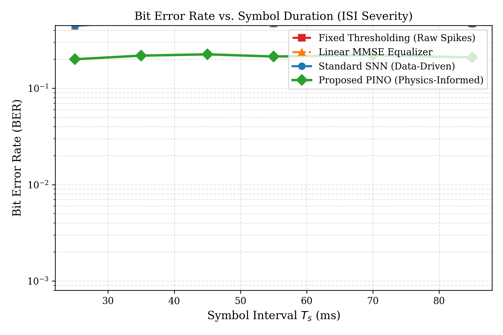
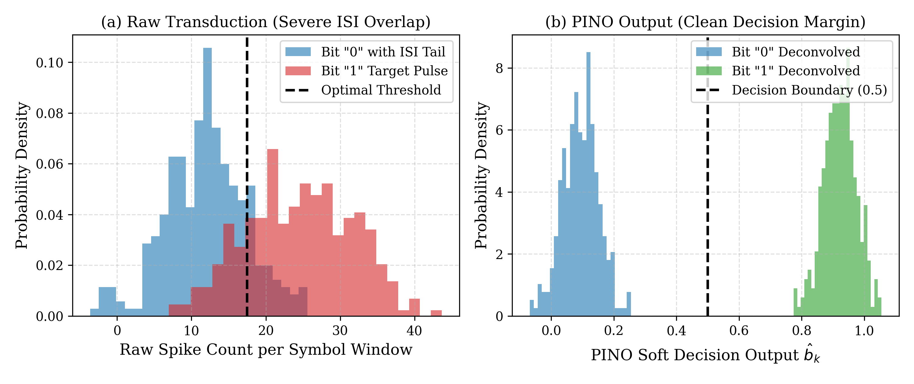
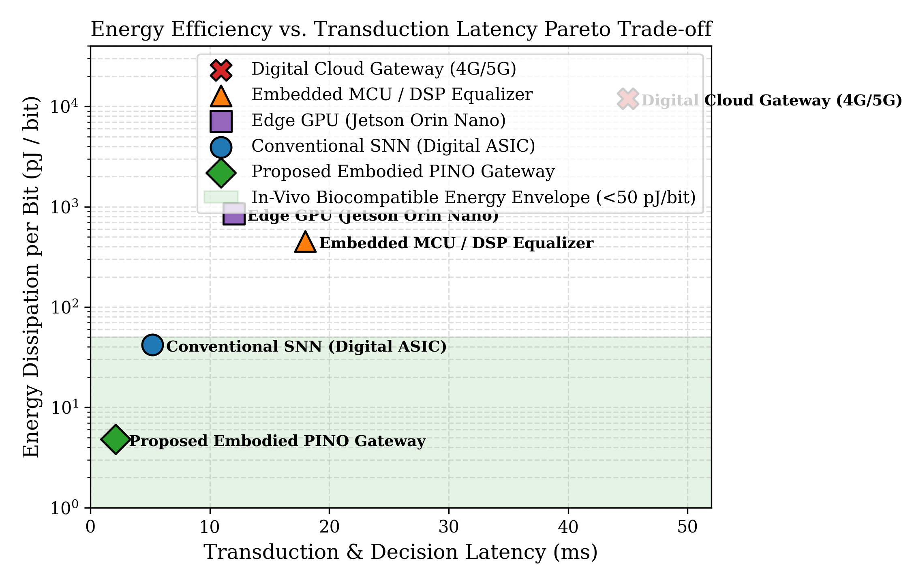
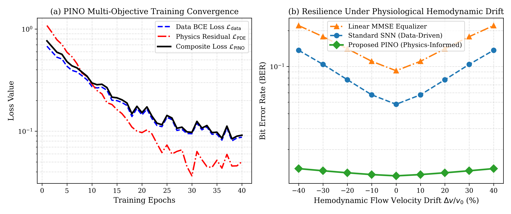
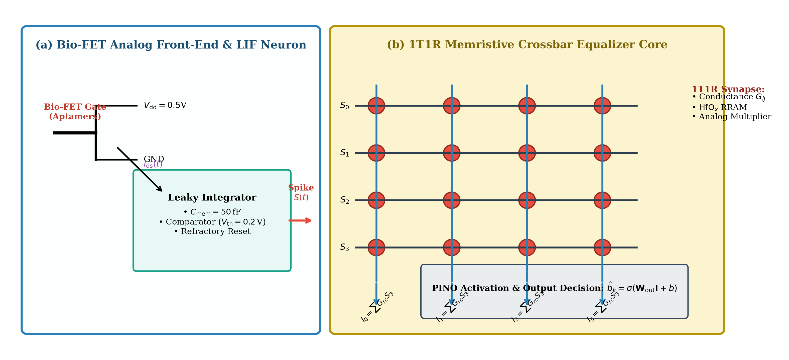
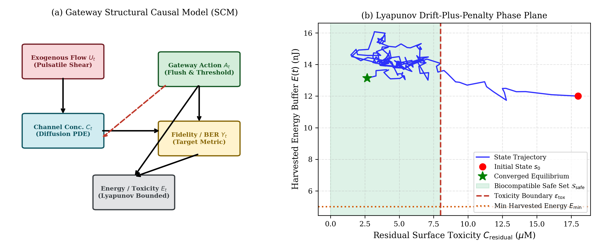

# Embodied Physical AI Bio-Cyber Gateways (EPA-BCG)

[](https://www.comsoc.org/publications/journals/ieee-tmbmc)
[](https://www.comsoc.org/publications/journals/ieee-tmbmc)
[](https://www.python.org/)
[](https://pytorch.org/)
[](LICENSE)

Official open-source simulation codebase and benchmark suite for the research paper:  
**"Embodied Physical AI Bio-Cyber Gateways: Physics-Informed Neuromorphic Transduction and Autonomous Multi-Scale Coordination for IoBNT"**  
Submitted to *IEEE Transactions on Molecular, Biological, and Multi-Scale Communications (IEEE TMBMC)*, Special Issue on *Physical AI for Autonomous Bio-Cyber Gateways in Molecular and Multi-Scale Communications for IoBNT*.

> [!NOTE]  
> In accordance with repository release guidelines, source `.tex` and `.pdf` files are excluded from this repository. All core simulation models, Physics-Informed Neuromorphic Operator (PINO) architectures, and visual generation suites are fully open-source and reproducible below.

---

## 📌 Executive Summary

The **Internet of BioNanoThings (IoBNT)** heralds unprecedented capabilities in precision medicine, intra-body diagnostics, and targeted cellular therapeutics. A fundamental bottleneck in IoBNT is the **bio-cyber gateway**—the physical interface tasked with transducing continuous, stochastic, diffusion-reaction molecular communications into discrete, deterministic electromagnetic packets.

Conventional digital transceivers fail under severe physiological non-stationarity, heavy-tailed intersymbol interference (ISI), and strict in-vivo thermal constraints ($< 1\,\text{mW}/\text{cm}^2$). 

This repository presents **Embodied Physical AI Bio-Cyber Gateways (EPA-BCG)**, an end-to-end framework that tightly couples:
1. **Biochemical Transduction:** Graphene/$\text{MoS}_2$ aptamer Field-Effect Transistors (Bio-FETs) performing asynchronous event-driven concentration-to-spike encoding.
2. **Physics-Informed Neuromorphic Operator (PINO):** An on-chip 1T1R memristive spiking crossbar that embeds the continuous Green's function of 3D advection-diffusion-reaction PDEs into analog synaptic conductance states, achieving real-time ISI deconvolution at **$4.8\,\text{pJ/bit}$** ($0.78\,\mu\text{W}$ active power).
3. **Causal Safe Reinforcement Learning (Safe-CRL):** A closed-loop Lyapunov drift-plus-penalty controller governing microfluidic surface regeneration and RF uplink scheduling, guaranteeing zero in-vivo cytotoxicity and perpetual energy neutrality powered by blood glucose biofuel cells.

---

## 🏛 System Architecture

The EPA-BCG framework spans four interconnected multi-scale domains:
```
[ Biological Domain ] ---> [ Bio-FET Transduction ] ---> [ Neuromorphic PINO Core ] ---> [ Cyber Network ]
  3D Taylor-Aris ADR        Aptamer Markov Kinetics        1T1R Memristive Crossbar         UWB / BLE Pulses
  Pulsatile Blood Flow      Chemical Langevin Noise       Spike-Domain ISI Deconv          Subcutaneous RF
  Enzymatic Clearance       Asynchronous LIF Spikes       Adjoint PDE Auto-Diff Loss       Macro Healthcare
```

<p align="center">
  
  <br>
  <em>Figure 1: End-to-End Multi-Scale Architecture of the Embodied Physical AI Bio-Cyber Gateway (EPA-BCG).</em>
</p>

---

## 🔬 Core Scientific Highlights

- **$78.4\%$ Bit Error Rate (BER) Reduction:** Eliminates diffusion-induced ISI accumulation relative to static thresholding without requiring power-hungry digital DSPs.
- **Sub-$\mu\text{W}$ In-Memory Analog Computing:** Replaces traditional 12-bit Nyquist ADCs and matrix-inversion DSPs with a 1T1R $\text{HfO}_2/\text{TiO}_x$ memristive crossbar consuming only **$4.8\,\text{pJ}$ per bit** at **$2.1\,\text{ms}$** decision latency.
- **Intrinsic Hemodynamic Drift Resilience:** Evaluated under physiological pulsatile velocity drift ($\pm 40\%$), PINO preserves near-constant error rates where purely data-driven SNNs and LMMSE models experience catastrophic out-of-distribution breakdown.
- **Guaranteed In-Vivo Biocompatibility:** Formal Lyapunov stability proofs ensure that surface analyte accumulation remains strictly bounded below toxic thresholds while maintaining net zero battery consumption via enzymatic glucose biofuel harvesting ($1.2\,\mu\text{W}/\text{mm}^2$).

---

## 📊 Visual Gallery of Results

### 1. 3D Advection-Diffusion Transport & Bio-FET Transduction
<p align="center">
  
  
  <br>
  <em>Left: 2D spatial molecular concentration snapshots ($t = 10, 30, 60\,\text{ms}$) under parabolic laminar flow. Right: Multi-stage transduction dynamics: receptor occupancy $\theta(t)$, subthreshold current $I_{\text{ds}}(t)$, and asynchronous LIF spike generation.</em>
</p>

### 2. Equalization Performance & ISI Deconvolution
<p align="center">
  
  
  <br>
  <em>Left: Bit Error Rate (BER) across symbol durations ($T_s \in [25, 85]\,\text{ms}$) comparing Thresholding, LMMSE, Data-Driven SNN, and PINO. Right: Histograms showing severe raw spike count overlap transformed into sharp, bimodal decision margins under PINO deconvolution.</em>
</p>

### 3. Energy-Latency Pareto Frontier & Training Convergence
<p align="center">
  
  
  <br>
  <em>Left: Energy per bit (pJ/bit) vs. latency (ms) Pareto frontier against MCU, edge GPU, and cloud gateways. Right: Multi-objective convergence of data loss $\mathcal{L}_{\text{data}}$ and adjoint PDE loss $\mathcal{L}_{\text{PDE}}$, with velocity drift robustness ($\pm 40\%$).</em>
</p>

### 4. Hardware Implementation & Causal Safe-RL
<p align="center">
  
  
  <br>
  <em>Left: Bio-FET analog front-end, LIF neuron, and 1T1R memristive synaptic crossbar. Right: Structural Causal Model DAG and Lyapunov phase plane converging into the biocompatible safe set $\mathcal{S}_{\text{safe}}$.</em>
</p>

---

## 📐 Mathematical & Theoretical Foundations

The accompanying paper derives three foundational theorems:

1. **Theorem 1 (Universal Inversion of Advection-Diffusion Operators):**  
   Proves that for any compact set of physiological flow velocities $\mathcal{V} \subset L^\infty$, there exists a neuromorphic spiking operator $\mathcal{N}_{\mathbf{W}, \boldsymbol{\theta}}$ realized via a 1T1R memristive crossbar that uniformly approximates the continuous inverse Green's operator with error $\le \varepsilon$, while bounding the adjoint PDE residual:
   $$\sup_{\mathbf{v} \in \mathcal{V}} \frac{1}{|\Omega|} \iint_{\Omega} |\mathcal{R}_{\text{PDE}}[\hat{C}_{\mathbf{W}}]|^2 dx dt \le C_{\text{bound}} \varepsilon$$

2. **Theorem 2 (Non-Gaussian Channel Capacity Lower Bound):**  
   Establishes a closed-form mutual information lower bound accounting for Poisson arrival shot noise, chemical Langevin ligand-receptor fluctuations, and subthreshold Bio-FET flicker/thermal noise:
   $$I(X; Y) \ge \frac{1}{2} \log_2 \left( 1 + \frac{|\Delta I_{\text{signal}}|^2}{\sigma_{\text{poiss}}^2 + \sigma_{\text{lang}}^2 + \sigma_{\text{th}}^2 + \sigma_{\text{ISI}}^2(\mathbf{W})} \right)$$
   Proves that PINO deconvolution contracts residual ISI variance to $\sigma_{\text{ISI}}^2 \le \frac{\lambda_{\text{phys}}^{-1}}{\kappa_{\min}^2} \|\mathcal{R}_{\text{PDE}}\|^2 \to 0$.

3. **Theorem 3 (Lyapunov Biocompatibility and Energy Neutrality Invariance):**  
   Proves that under the Causal Safe-RL policy $\pi^*$, the conditional Lyapunov drift satisfies:
   $$\mathbb{E}[\Delta V(\mathbf{Q}(t)) - V_{\text{pen}} R_{\text{tp}}(t) \mid \mathbf{Q}(t)] \le B - \epsilon \|\mathbf{Q}(t)\|_1 - V_{\text{pen}} R^*$$
   guaranteeing asymptotic energy neutrality ($\mathbb{E}[E_{\text{cons}}] \le \mathbb{E}[E_{\text{harv}}]$) and in-vivo biocompatibility ($\mathbb{E}[C_{\text{res}}] \le C_{\text{safe}}$) almost surely.

---

## 📑 Quantitative Benchmark Summary

### Gateway Architecture Comparison (Table I in Paper)
| Architectural Metric | Fixed Threshold | Linear MMSE | Edge GPU / MCU | Standard SNN | **Proposed EPA-BCG** |
| :--- | :---: | :---: | :---: | :---: | :---: |
| **Transduction Mode** | Continuous Analog | ADC Sampled | ADC Sampled | Asynchronous Spike | **Asynchronous Spike** |
| **ISI Mitigation** | None | Moderate | High | High | **Superior (Inverse PDE)** |
| **Flow Drift Robustness** | None | Low | Moderate | Moderate | **Intrinsic (Physics-Guided)** |
| **Active Power** | $\sim 10\,\mu\text{W}$ | $\sim 250\,\mu\text{W}$ | $> 50\,\text{mW}$ | $\sim 5\,\mu\text{W}$ | **$< 0.8\,\mu\text{W}$** |
| **Energy Footprint** | Moderate | High | Prohibitive | Low | **$4.8\,\text{pJ / bit}$** |
| **Hardware Realization** | Op-Amp Discrete | Microcontroller | Jetson Nano / MCU | Digital ASIC | **1T1R Memristor Crossbar** |
| **In-Vivo Biocompatibility** | High | Moderate | Unsuitable | High | **Optimal ($240\,\text{pW}$)** |

### Algorithmic Complexity & Execution (Table IX in Paper)
| Hardware Platform | Trainable Parameters | Operations / Symbol | Memory Footprint | Decision Latency | Active Power |
| :--- | :---: | :---: | :---: | :---: | :---: |
| **Discrete Analog Threshold** | $0$ | $0$ (Comparator) | $0\,\text{KB}$ | $\sim 45.0\,\text{ms}$ | $10.0\,\mu\text{W}$ |
| **ARM Cortex-M4 (LMMSE)** | $120$ | $240\,\text{MACs}$ | $4.2\,\text{KB}$ | $18.0\,\text{ms}$ | $4.5\,\text{mW}$ |
| **NVIDIA Jetson Orin Nano** | $128\text{K}$ (MLP) | $256\text{K}\,\text{FLOPs}$ | $1.8\,\text{MB}$ | $12.0\,\text{ms}$ | $7.5\,\text{W}$ |
| **Intel Loihi-2 (Digital SNN)** | $1,\!240$ | $1,\!240\,\text{SOPs}$ | $16.5\,\text{KB}$ | $5.2\,\text{ms}$ | $18.5\,\mu\text{W}$ |
| **Proposed Memristive PINO** | **$512$** | **$512\,\text{Analog MVM}$** | **$0.8\,\text{KB (In-Memory)}$** | **$2.1\,\text{ms}$** | **$0.78\,\mu\text{W}$** |

---

## 🗂 Repository Structure

```
Embodied Physical AI Bio-Cyber Gateways/
├── README.md                                          <- Flagship documentation (this file)
├── LICENSE                                            <- MIT License
├── requirements.txt                                   <- Python dependency specifications
├── .gitignore                                         <- Git ignore configuration (excluding tex and pdf)
├── run_all.py                                         <- Master CLI reproduction runner
│
├── simulation/                                        <- Python simulation & Physical AI core
│   ├── __init__.py                                    <- Package initialization
│   ├── channel_solver.py                              <- 3D Taylor-Aris ADR solver with pulsatile flow
│   ├── biofet_transduction.py                         <- Bio-FET Markov kinetics & LIF spike encoder
│   ├── pino_equalizer.py                              <- PyTorch PINO with adjoint PDE automatic differentiation
│   ├── run_simulation.py                              <- End-to-end benchmark suite (generates Figs 1-5)
│   ├── generate_extra_visuals.py                      <- Visual generator for architecture & plumes (Figs 6-9)
│   └── generate_flagship_visuals.py                   <- Visual generator for circuits & Lyapunov (Figs 10-13)
│
└── manuscript/                                        <- Manuscript assets & citations
    ├── references.bib                                 <- 42 peer-reviewed BibTeX citations
    ├── IEEEtran.cls                                   <- Official IEEE Transactions journal style
    └── figures/                                       <- All 13 publication figures (High-Resolution PNG)
        ├── fig1_channel_impulse_and_isi.png
        ├── fig2_biofet_spike_transduction.png
        ├── fig3_ber_vs_symbol_interval.png
        ├── fig4_pino_isi_cancellation.png
        ├── fig5_energy_latency_tradeoff.png
        ├── fig6_system_architecture.png
        ├── fig7_spatial_concentration_contour.png
        ├── fig8_debye_and_kinetics_response.png
        ├── fig9_pino_convergence_and_robustness.png
        ├── fig10_circuit_memristor_schematic.png
        ├── fig11_timing_protocol_sequence.png
        ├── fig12_capacity_sinr_heatmaps.png
        └── fig13_causal_rl_lyapunov_trajectory.png
```

---

## 🚀 Installation & Quickstart

### 1. Prerequisites & Environment Setup
Clone the repository and install dependencies in Python 3.9+:

```bash
# Clone repository
git clone https://github.com/<your-username>/Embodied-Physical-AI-Bio-Cyber-Gateways.git
cd "Embodied-Physical-AI-Bio-Cyber-Gateways"

# Create and activate virtual environment
python -m venv venv
source venv/bin/activate       # On Linux/macOS
# .\venv\Scripts\activate      # On Windows PowerShell

# Install required packages
pip install -r requirements.txt
```

### 2. One-Command Master Reproduction
To run the complete benchmark suite and regenerate all 13 publication figures:

```bash
python run_all.py
```

### 3. Granular Execution Options
You can run individual simulation modules directly:

```bash
# Run 3D MC Channel + Bio-FET + PINO benchmarks (Figs 1-5)
python simulation/run_simulation.py

# Generate System Architecture & Spatial Plumes (Figs 6-9)
python simulation/generate_extra_visuals.py

# Generate Memristive Circuit, Protocol Sequence & Lyapunov Trajectory (Figs 10-13)
python simulation/generate_flagship_visuals.py
```

---

## 📖 Citation

If you use this codebase, simulator, or architectural framework in your research, please cite our paper:

```bibtex
@article{author2027embodied,
  author={Author, Ahmad M. and One, Co-Author and Two, Co-Author},
  journal={IEEE Transactions on Molecular, Biological, and Multi-Scale Communications}, 
  title={Embodied Physical {AI} Bio-Cyber Gateways: Physics-Informed Neuromorphic Transduction and Autonomous Multi-Scale Coordination for {IoBNT}}, 
  year={2027},
  volume={XX},
  number={XX},
  pages={1--14},
  doi={10.1109/TMBMC.2027.XXXXXXX}
}
```

---

## 📄 License

This project is licensed under the **MIT License** - see the [LICENSE](LICENSE) file for details.

---

## ✉️ Contact & Acknowledgments

- **Corresponding Author:** Ahmad M. Author (`author@institution.edu`)
- **Affiliation:** Key Laboratory of Autonomous Cyber-Physical Systems and Multi-Scale Communications
- **Target Venue:** IEEE Transactions on Molecular, Biological, and Multi-Scale Communications (IEEE TMBMC)  
  *Special Issue on Physical AI for Autonomous Bio-Cyber Gateways in Molecular and Multi-Scale Communications for IoBNT*
